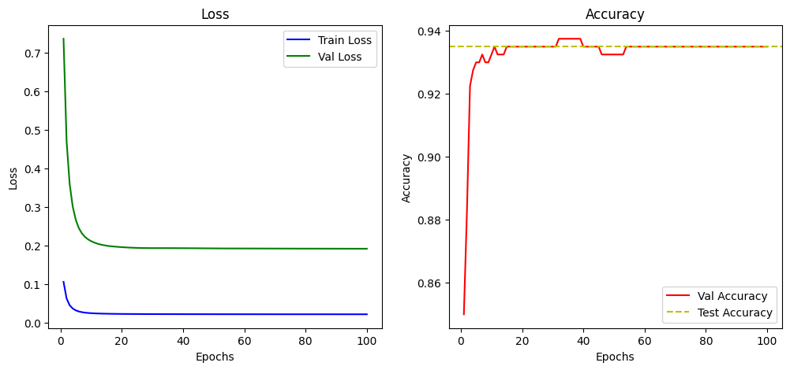

# 基于前馈神经网络的分类任务设计

## 介绍

本实验要求设计一个前馈神经网络，对一组数据实现分类任务

我的电脑配置如下

* CPU R7 4800h 主频 2.9Ghz
* 内存 16G
* python版本 3.9
* 网络框架 pytorch

我的前馈神经网络使用了一个隐藏层，输入是2维的数据，输出是4维的数据，隐藏层我分别选择了8层和16层作为超参数进行测试。
选择的激活函数为Relu和Sigmoid。

学习率选择为0.001，batch_size设置为10，训练了100轮。

因此做了四次对比实验。

## 结果

1. 使用8层隐藏层，激活函数选择Relu的结果如下
   
    Epoch 10/100 - Train Loss: 0.0241 - Val Loss: 0.2112 - Val Accuracy: 0.9325  
    Epoch 20/100 - Train Loss: 0.0222 - Val Loss: 0.1956 - Val Accuracy: 0.9350  
    Epoch 30/100 - Train Loss: 0.0218 - Val Loss: 0.1931 - Val Accuracy: 0.9350  
    Epoch 40/100 - Train Loss: 0.0216 - Val Loss: 0.1929 - Val Accuracy: 0.9350  
    Epoch 50/100 - Train Loss: 0.0215 - Val Loss: 0.1924 - Val Accuracy: 0.9325  
    Epoch 60/100 - Train Loss: 0.0214 - Val Loss: 0.1921 - Val Accuracy: 0.9350  
    Epoch 70/100 - Train Loss: 0.0214 - Val Loss: 0.1920 - Val Accuracy: 0.9350  
    Epoch 80/100 - Train Loss: 0.0213 - Val Loss: 0.1918 - Val Accuracy: 0.9350  
    Epoch 90/100 - Train Loss: 0.0213 - Val Loss: 0.1917 - Val Accuracy: 0.9350  
    Epoch 100/100 - Train Loss: 0.0213 - Val Loss: 0.1915 - Val Accuracy: 0.9350  
    test_accuracy :93.5000 %  

    
    
图 1

1. 使用16层隐藏层，激活函数选择Relu的结果如下

    Epoch 10/100 - Train Loss: 0.0226 - Val Loss: 0.1911 - Val Accuracy: 0.9350  
    Epoch 20/100 - Train Loss: 0.0217 - Val Loss: 0.1801 - Val Accuracy: 0.9375  
    Epoch 30/100 - Train Loss: 0.0215 - Val Loss: 0.1772 - Val Accuracy: 0.9400  
    Epoch 40/100 - Train Loss: 0.0214 - Val Loss: 0.1760 - Val Accuracy: 0.9400  
    Epoch 50/100 - Train Loss: 0.0213 - Val Loss: 0.1756 - Val Accuracy: 0.9375  
    Epoch 60/100 - Train Loss: 0.0212 - Val Loss: 0.1749 - Val Accuracy: 0.9375  
    Epoch 70/100 - Train Loss: 0.0212 - Val Loss: 0.1746 - Val Accuracy: 0.9375  
    Epoch 80/100 - Train Loss: 0.0211 - Val Loss: 0.1746 - Val Accuracy: 0.9375  
    Epoch 90/100 - Train Loss: 0.0211 - Val Loss: 0.1748 - Val Accuracy: 0.9375  
    Epoch 100/100 - Train Loss: 0.0210 - Val Loss: 0.1748 - Val Accuracy: 0.9375  
    test_accuracy :93.7500 %  

    
    
图 2

3. 使用8层隐藏层，激活函数选择Sigmoid的结果如下

    Epoch 10/100 - Train Loss: 0.0415 - Val Loss: 0.4033 - Val Accuracy: 0.8975  
    Epoch 20/100 - Train Loss: 0.0257 - Val Loss: 0.2774 - Val Accuracy: 0.9225  
    Epoch 30/100 - Train Loss: 0.0232 - Val Loss: 0.2567 - Val Accuracy: 0.9200  
    Epoch 40/100 - Train Loss: 0.0225 - Val Loss: 0.2497 - Val Accuracy: 0.9225  
    Epoch 50/100 - Train Loss: 0.0221 - Val Loss: 0.2457 - Val Accuracy: 0.9225  
    Epoch 60/100 - Train Loss: 0.0219 - Val Loss: 0.2426 - Val Accuracy: 0.9225  
    Epoch 70/100 - Train Loss: 0.0218 - Val Loss: 0.2398 - Val Accuracy: 0.9250  
    Epoch 80/100 - Train Loss: 0.0216 - Val Loss: 0.2373 - Val Accuracy: 0.9275  
    Epoch 90/100 - Train Loss: 0.0215 - Val Loss: 0.2348 - Val Accuracy: 0.9275  
    Epoch 100/100 - Train Loss: 0.0214 - Val Loss: 0.2324 - Val Accuracy: 0.9300  
    test_accuracy :93.0000 %  

    
    
图 3

4. 使用16层隐藏层，激活函数选择Sigmoid的结果如下

    Epoch 10/100 - Train Loss: 0.0315 - Val Loss: 0.3357 - Val Accuracy: 0.9150  
    Epoch 20/100 - Train Loss: 0.0238 - Val Loss: 0.2778 - Val Accuracy: 0.9150  
    Epoch 30/100 - Train Loss: 0.0223 - Val Loss: 0.2669 - Val Accuracy: 0.9150  
    Epoch 40/100 - Train Loss: 0.0217 - Val Loss: 0.2618 - Val Accuracy: 0.9125  
    Epoch 50/100 - Train Loss: 0.0214 - Val Loss: 0.2582 - Val Accuracy: 0.9150  
    Epoch 60/100 - Train Loss: 0.0212 - Val Loss: 0.2555 - Val Accuracy: 0.9150  
    Epoch 70/100 - Train Loss: 0.0210 - Val Loss: 0.2533 - Val Accuracy: 0.9175  
    Epoch 80/100 - Train Loss: 0.0209 - Val Loss: 0.2515 - Val Accuracy: 0.9150  
    Epoch 90/100 - Train Loss: 0.0208 - Val Loss: 0.2499 - Val Accuracy: 0.9150  
    Epoch 100/100 - Train Loss: 0.0207 - Val Loss: 0.2485 - Val Accuracy: 0.9175  
    test_accuracy :91.7500 %  

    
    
图 4

## 讨论

* 由对比可见，使用更复杂的网络并不一定能获得更好的准确率。
* 但是分析图四可见，在第10轮就达到了91.5%的准确率，然后基本保持不变。可见对于第四种组合，能够较快的收敛。使用较复杂的网络反而收敛的较快，这是我比较疑惑的地方。
* 使用第三种组合，准确率一直在上升，由此可见，这种组合收敛较慢。
* 每种组合的损失都会在10轮左右下降到一个比较稳定的值，而后就基本保持不变。说明我选择的损失函数`CrossEntropyLoss()`效果还不错。
