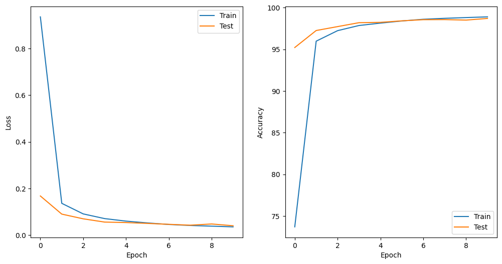
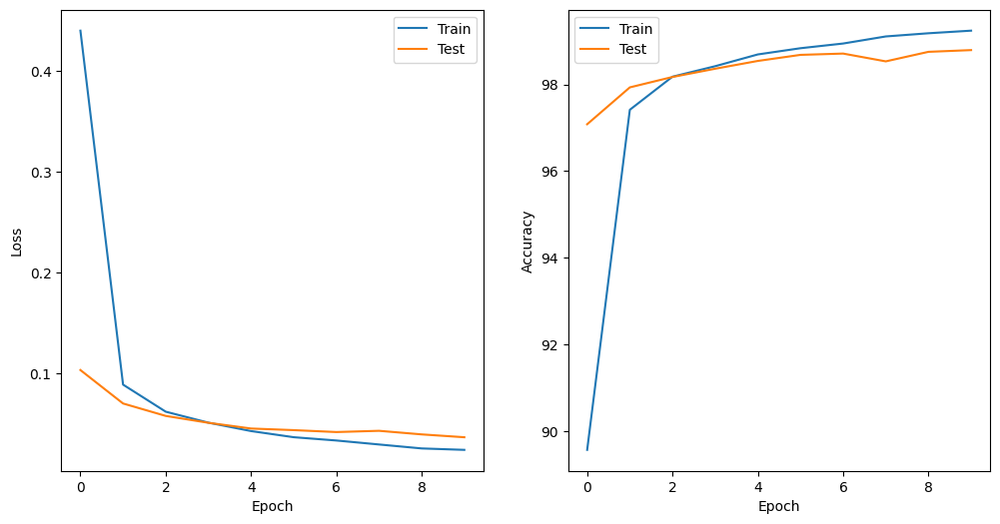

# 基于卷积神经网络的MNIST手写体数字识别

## 介绍

任务要求：设计一个卷积神经网络，并在其中使用ResNet模块，在MNIST数据集上实现10分类手写体数字识别。

我的电脑配置如下

* CPU R7 4800h 主频 2.9Ghz
* 内存 16G
* python版本 3.10
* 网络框架 pytorch

我设计了两种网络结构如下所示，仅使用一个resnet模块。只是resnet模块的位置不同，第一种网络在全连接层之前使用resnet模块，第二种网络在第一个全连接层之后使用resnet模块。
其他超参数设置如下
* 激活函数均使用relu
* 损失函数均使用交叉熵损失函数
* 优化器均选择SGD优化器
* 学习率设置为0.001
* batch_size设置为64
* 分别训练10轮

```1
Net(
  (conv1): Conv2d(1, 6, kernel_size=(5, 5), stride=(1, 1))
  (pool): MaxPool2d(kernel_size=2, stride=2, padding=0, dilation=1, ceil_mode=False)
  (conv2): Conv2d(6, 16, kernel_size=(5, 5), stride=(1, 1))
  (resnet_block): ResNet(
    (conv1): Conv2d(16, 16, kernel_size=(3, 3), stride=(1, 1), padding=(1, 1), bias=False)
    (bn1): BatchNorm2d(16, eps=1e-05, momentum=0.1, affine=True, track_running_stats=True)
    (relu): ReLU(inplace=True)
    (conv2): Conv2d(16, 16, kernel_size=(3, 3), stride=(1, 1), padding=(1, 1), bias=False)
    (bn2): BatchNorm2d(16, eps=1e-05, momentum=0.1, affine=True, track_running_stats=True)
    (shortcut): Sequential()
  )
  (fc1): Linear(in_features=256, out_features=120, bias=True)
  (fc2): Linear(in_features=120, out_features=84, bias=True)
  (fc3): Linear(in_features=84, out_features=10, bias=True)
)
```
 <center>网络 1</center>


```2
Net(
  (conv1): Conv2d(1, 6, kernel_size=(5, 5), stride=(1, 1))
  (pool): MaxPool2d(kernel_size=2, stride=2, padding=0, dilation=1, ceil_mode=False)
  (conv2): Conv2d(6, 16, kernel_size=(5, 5), stride=(1, 1))
  (fc1): Linear(in_features=256, out_features=120, bias=True)
  (resnet_block): ResNet(
    (conv1): Conv2d(120, 120, kernel_size=(3, 3), stride=(1, 1), padding=(1, 1), bias=False)
    (bn1): BatchNorm2d(120, eps=1e-05, momentum=0.1, affine=True, track_running_stats=True)
    (relu): ReLU(inplace=True)
    (conv2): Conv2d(120, 120, kernel_size=(3, 3), stride=(1, 1), padding=(1, 1), bias=False)
    (bn2): BatchNorm2d(120, eps=1e-05, momentum=0.1, affine=True, track_running_stats=True)
    (shortcut): Sequential()
  )
  (fc2): Linear(in_features=120, out_features=84, bias=True)
  (fc3): Linear(in_features=84, out_features=10, bias=True)
)
```
 <center>网络 2</center>

## 结果


1. 使用网络一得到的结果如下所示。
    ```
    Epoch 1, train:: loss: 0.9363, accuracy: 73.7050%  test:: loss: 0.1677, accuracy: 95.2200%
    Epoch 2, train:: loss: 0.1362, accuracy: 95.9817%  test:: loss: 0.0900, accuracy: 97.2600%
    Epoch 3, train:: loss: 0.0909, accuracy: 97.2433%  test:: loss: 0.0698, accuracy: 97.7300%
    Epoch 4, train:: loss: 0.0707, accuracy: 97.8617%  test:: loss: 0.0558, accuracy: 98.2000%
    Epoch 5, train:: loss: 0.0599, accuracy: 98.1483%  test:: loss: 0.0537, accuracy: 98.2400%
    Epoch 6, train:: loss: 0.0522, accuracy: 98.4067%  test:: loss: 0.0501, accuracy: 98.4200%
    Epoch 7, train:: loss: 0.0455, accuracy: 98.6100%  test:: loss: 0.0462, accuracy: 98.5600%
    Epoch 8, train:: loss: 0.0412, accuracy: 98.7233%  test:: loss: 0.0424, accuracy: 98.5700%
    Epoch 9, train:: loss: 0.0383, accuracy: 98.8133%  test:: loss: 0.0477, accuracy: 98.5100%
    Epoch 10, train:: loss: 0.0353, accuracy: 98.8983%  test:: loss: 0.0400, accuracy: 98.7100%
    Accuracy of     0 : 98 %
    Accuracy of     1 : 98 %
    Accuracy of     2 : 97 %
    Accuracy of     3 : 96 %
    Accuracy of     4 : 98 %
    Accuracy of     5 : 95 %
    Accuracy of     6 : 98 %
    Accuracy of     7 : 100 %
    Accuracy of     8 : 100 %
    Accuracy of     9 : 98 %
    ```

    损失以及准确率图像如图一所示。
    
     <center>图 1</center>


2. 使用网络二的结果如下所示。
    ```2
    Epoch 1, train:: loss: 0.4401, accuracy: 89.5683%  test:: loss: 0.1036, accuracy: 97.0800%
    Epoch 2, train:: loss: 0.0892, accuracy: 97.4133%  test:: loss: 0.0705, accuracy: 97.9300%
    Epoch 3, train:: loss: 0.0624, accuracy: 98.1767%  test:: loss: 0.0582, accuracy: 98.1700%
    Epoch 4, train:: loss: 0.0515, accuracy: 98.4183%  test:: loss: 0.0513, accuracy: 98.3600%
    Epoch 5, train:: loss: 0.0431, accuracy: 98.6900%  test:: loss: 0.0457, accuracy: 98.5400%
    Epoch 6, train:: loss: 0.0371, accuracy: 98.8333%  test:: loss: 0.0441, accuracy: 98.6800%
    Epoch 7, train:: loss: 0.0338, accuracy: 98.9417%  test:: loss: 0.0422, accuracy: 98.7100%
    Epoch 8, train:: loss: 0.0298, accuracy: 99.1050%  test:: loss: 0.0434, accuracy: 98.5300%
    Epoch 9, train:: loss: 0.0259, accuracy: 99.1783%  test:: loss: 0.0398, accuracy: 98.7500%
    Epoch 10, train:: loss: 0.0245, accuracy: 99.2383%  test:: loss: 0.0370, accuracy: 98.7900%

    Accuracy of     0 : 100 %
    Accuracy of     1 : 97 %
    Accuracy of     2 : 100 %
    Accuracy of     3 : 96 %
    Accuracy of     4 : 98 %
    Accuracy of     5 : 95 %
    Accuracy of     6 : 94 %
    Accuracy of     7 : 100 %
    Accuracy of     8 : 100 %
    Accuracy of     9 : 98 %
    ```
    损失以及准确率图像如图二所示。
    
     <center>图 2</center>

## 讨论

* 由以上结果可知，两种网络都取得了比较好的结果。对比我在没使用resnet模块时，训练10轮的准确率仅有92%左右。而使用了resnet模块后，准确率均接近98%。可见resnet模块的作用十分明显。
* 两种网络训练的时间也比较接近，所以不同的网络架构对性能也没产生太大的影响。
* 数据归一化对简化网络以及加快训练有很大效果。数据规格化可以避免不同梯度之间差距过大而造成的性能下降，还能避免出现某些梯度消失而对准确率的影响。
* 使用第二种网络的效果略好于第一种网络，我猜测是因为第二种网络在卷积提取特征之后，在通过resnet模块进一步提取特征和整合，因此提取特征效果比较好，导致准确率比第一种网络高。


